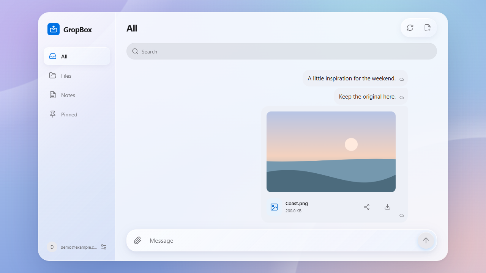
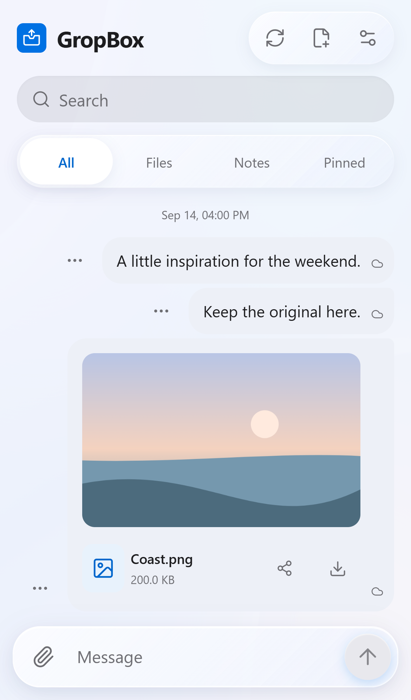

# GropBox

[](LICENSE)

A web transfer assistant for your devices. Files in Google Drive; messages synced with Supabase.

<table>
  <tr>
    <td width="77%"></td>
    <td width="23%"></td>
  </tr>
</table>

<sub>Actual interface, with sample content.</sub>

## Deploy yourself

1. [Download and run](docs/DEPLOY.md#1-run-setup) `npm run deploy`.
2. Authorize Supabase and Vercel; import your Google client file.
3. Confirm the targets. The tool configures and deploys your app.

[Setup guide](docs/DEPLOY.md) — no SQL or application keys to copy; first-time Google setup is still required.

## Deploy with an agent

Paste this into your coding agent:

```text
Deploy https://github.com/hadan8977/GropBox for my personal use.
Read AGENTS.md and docs/DEPLOY_AGENT.md from the same checkout first.
Use the deployment helper to do the work, not give me a checklist.
Confirm my accounts, targets, and costs; ask only for necessary
authorization and Google setup. Keep secrets out of chat and Git.
Report the URL and real checks passed; clearly label unverified checks.
```

[Dashboard / self-hosting](docs/DEPLOY_MANUAL.md) · [Architecture and limits](docs/MVP_PLAN.md)
